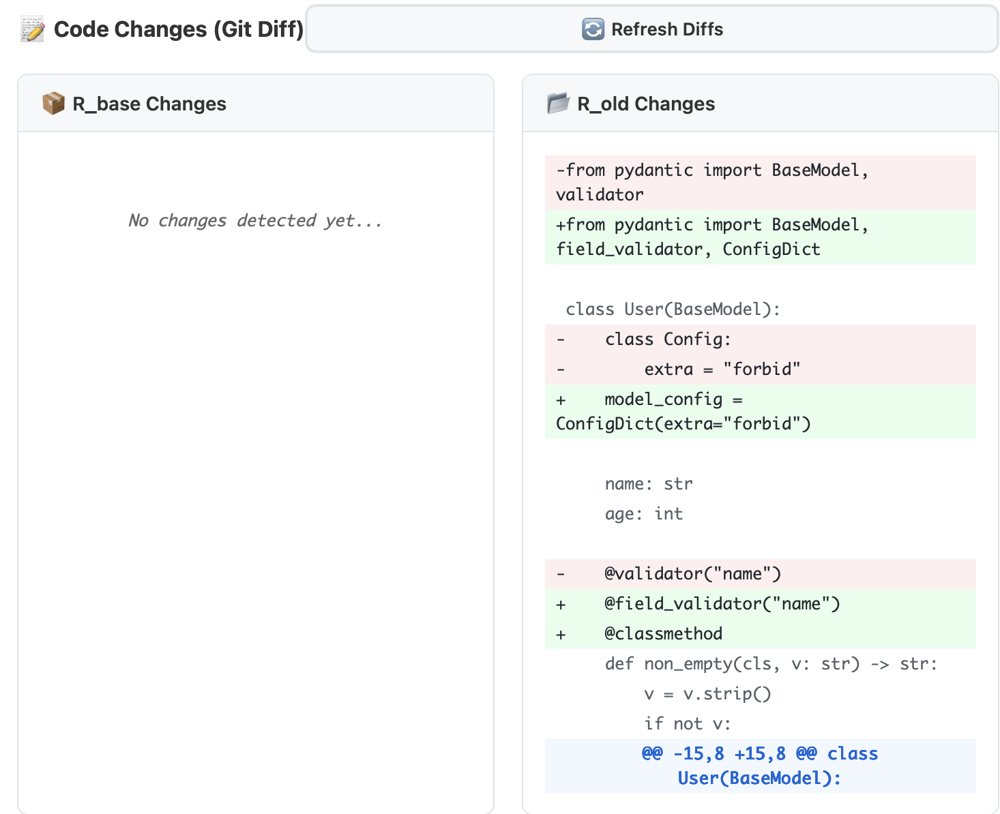

# 🔄 Weave Hack: ReviveAgent

**Automatically integrate older repositories with modern codebases using AI-powered analysis and migration.**

Rebibemecode is an intelligent Flask web application that leverages Claude Sonnet 4.5 to automatically analyze, adapt, and integrate legacy code repositories with their modern counterparts. Say goodbye to manual dependency resolution and compatibility issues!

---

## 🎥 Demo

Watch ReviveAgent in action:

[](https://www.youtube.com/watch?v=rmgXhW6sZ6o)


> *Full integration workflow showing repository analysis, dependency resolution, and code migration*

---

## ✨ Key Features

### 🤖 **AI-Powered Integration**
- Powered by **Claude Sonnet 4.5** via Cursor CLI
- Intelligent code analysis and dependency resolution
- Automatic compatibility fixes and version upgrades
- Context-aware code modifications

### 🌐 **Beautiful Web Interface**
- Modern, gradient-based UI design
- Real-time streaming output with Server-Sent Events (SSE)
- Live progress tracking and status updates
- Interactive job monitoring dashboard

### 📊 **Comprehensive Observability**
- **Weave Integration**: Full tracing and metrics via W&B Weave
- **Live Agent Output**: Real-time streaming of agent actions
- **Git Diff Viewer**: Side-by-side visualization of all code changes
- **Execution Statistics**: Token usage and tool call tracking

### 📝 **Side-by-Side Git Diff**
Beautiful GitHub-style diff viewer showing all changes made during integration:



*Real-time visualization of code changes in both R_base and R_old repositories*

### ⚡ **Smart Automation**
- Automatic conda environment setup
- Intelligent test script generation
- Dependency conflict resolution
- Version compatibility handling

---

## 🏗️ Architecture

```
┌─────────────────────────────────────────────────────────┐
│                    Flask Web App                        │
│  ┌───────────┐  ┌──────────┐  ┌───────────────────┐   │
│  │  Index    │  │ Results  │  │  API Endpoints    │   │
│  │  (Submit) │→ │  (Track) │  │  - /submit        │   │
│  └───────────┘  └──────────┘  │  - /status        │   │
│                                │  - /stream        │   │
│                                │  - /weave-data    │   │
│                                │  - /git-diff      │   │
│                                └───────────────────┘   │
└─────────────────────────────────────────────────────────┘
                         ↓
              ┌──────────────────────┐
              │   ReviveAgent        │
              │  (Cursor CLI Wrapper)│
              └──────────────────────┘
                         ↓
      ┌──────────────────────────────────────────┐
      │         Claude Sonnet 4.5                │
      │  - Code Analysis  - Dependency Resolution│
      │  - File Editing   - Test Generation      │
      └──────────────────────────────────────────┘
                         ↓
         ┌────────────────────────────────┐
         │  Work Directory                │
         │  ├── r_base/                   │
         │  ├── r_old/                    │
         │  ├── setup_r_base.sh           │
         │  ├── test_base.sh              │
         │  ├── test_old.sh               │
         │  └── agent_summary.txt         │
         └────────────────────────────────┘
```

---

## 🚀 Getting Started

### Prerequisites

- Python 3.9+
- Cursor CLI installed
- Conda/Mamba package manager
- Git
- Weights & Biases account (for Weave tracing)

### Installation

1. **Clone the repository**
   ```bash
   git clone <repository-url>
   cd rebibemecode
   ```

2. **Install dependencies**
   ```bash
   pip install -r requirements.txt
   ```

3. **Install Cursor CLI**
   ```bash
   curl https://cursor.com/install -fsS | bash
   ```

4. **Configure Weave** (optional but recommended)
   ```bash
   export WANDB_API_KEY=your_api_key
   ```

5. **Run the Flask app**
   ```bash
   python app.py
   ```

6. **Open your browser**
   ```
   http://localhost:8000
   ```

---

## 📖 Usage

### Web Interface

1. **Navigate to the home page** (`http://localhost:8000`)
2. **Enter repository URLs:**
   - **R_base**: The modern/latest repository (e.g., `https://github.com/Farama-Foundation/Gymnasium`)
   - **R_old**: The legacy repository to integrate (e.g., `https://github.com/igilitschenski/multi_car_racing/`)
3. **Click "Start Integration Process"**
4. **Monitor progress** in real-time on the results page

### Command Line Interface

```python
from classes.revive_agent import ReviveAgent
import classes.utils as utils

# Initialize agent
agent = ReviveAgent(model='sonnet-4.5')

# Run integration
result = utils.setup_r_base_environment(
    agent, 
    workdir="./work_dir", 
    GLOBAL_CONTEXT=context
)
```

---

## 🎯 Integration Workflow

1. **📦 Repository Cloning**
   - Clones both R_base and R_old repositories
   - Validates GitHub URLs
   - Handles both `main` and `master` branches

2. **🔧 R_base Environment Setup**
   - Analyzes repository structure
   - Creates conda environment (`env_r_base`)
   - Generates `setup_r_base.sh` script
   - Creates `test_base.sh` for validation

3. **📂 R_old Analysis**
   - Examines legacy code structure
   - Identifies dependencies
   - Creates `test_old.sh` for testing

4. **⚙️ Dependency Resolution**
   - Compares version requirements
   - Modifies R_old code for compatibility
   - Updates R_base environment only when necessary
   - Resolves import and API changes

5. **✅ Final Verification**
   - Runs both test suites
   - Validates integration success
   - Generates summary reports

---

## 📊 Dashboard Features

### Live Agent Output
Real-time streaming of agent actions with:
- 🔧 Tool call indicators (file operations, commands)
- 📊 Token usage and statistics
- ⏱️ Execution timing

### Weave Trace Visualization
- **Status Overview**: Job status, duration, total calls
- **Call Tree**: Hierarchical view of function executions
- **Direct Links**: Jump to W&B Weave dashboard

### Git Diff Viewer
- **Side-by-side comparison** of changes
- **Syntax highlighting** (added/removed/context lines)
- **File-by-file breakdown**
- **Auto-refresh** during execution

### Repository Information
- Source URLs for both repositories
- Work directory location
- Execution timestamps
- Final statistics

---

## 📁 Project Structure

```
rebibemecode/
├── app.py                      # Main Flask application
├── main.py                     # CLI entry point
├── requirements.txt            # Python dependencies
├── classes/
│   ├── revive_agent.py        # Cursor CLI wrapper
│   ├── utils.py               # Integration utilities
│   └── clean_logger.py        # Stream output parser
├── templates/
│   ├── index.html             # Landing page
│   └── results.html           # Job dashboard
├── docs/
│   ├── STREAMING_GUIDE.md     # Streaming documentation
│   └── WEB_INTERFACE_README.md # Web UI guide
├── tests/
│   └── test_streaming.py      # Unit tests
└── work_dir/                  # Job execution workspace
```

---

## ⚙️ Configuration

### Environment Variables

```bash
# Weave/W&B Configuration
export WANDB_API_KEY=your_api_key
export WEAVE_PROJECT_NAME=rebibemecode-web-app

# Flask Configuration
export FLASK_ENV=development
export FLASK_DEBUG=1
```

### Global Context Customization

Edit the `GLOBAL_CONTEXT` in `app.py` to customize agent behavior:

```python
GLOBAL_CONTEXT = """
Global context:
You are an integration agent...

IMPORTANT COMMAND EXECUTION RULES:
- When running shell commands, ALWAYS use proper syntax
- When installing packages with versions, use quotes: pip install "package==1.2.0"
- Activate conda environments explicitly before installing packages
...
"""
```

---

## 🔍 Debugging

### View Weave Traces
```
https://wandb.ai/mbzuai-llm/rebibemecode-web-app/weave
```

### Check Job Status
```
GET /status/<job_id>
```

### Debug Weave Integration
```
GET /debug-weave/<job_id>
```

### View Git Diffs
```
GET /git-diff/<job_id>
```

---

## 🤝 Contributing

Contributions are welcome! Here's how you can help:

1. Fork the repository
2. Create a feature branch (`git checkout -b feature/AmazingFeature`)
3. Commit your changes (`git commit -m 'Add some AmazingFeature'`)
4. Push to the branch (`git push origin feature/AmazingFeature`)
5. Open a Pull Request

---

## 📝 License

This project is licensed under the MIT License - see the LICENSE file for details.

---

## 📧 Contact

For questions, issues, or suggestions:
- Open an issue on GitHub
- Check the documentation in `/docs`
- View our [Weave dashboard](https://wandb.ai/mbzuai-llm/rebibemecode-web-app/weave)


*Rebibemecode - Making legacy code integration effortless*
